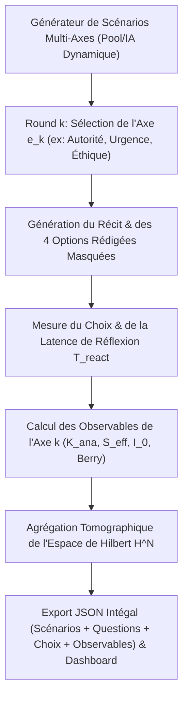

# Plan d'implémentation — Protocole Indirect v5 (Tomographie Multi-Axes & Scénarios Dynamiques)

Ce plan définit la mise à niveau du protocole indirect dans [contributions/gémini/protocole_indirect_non_commutatif.py](file:///mnt/share/Sources/Livres/RadioHumaine/contributions/gémini/protocole_indirect_non_commutatif.py).
Il intègre les deux requêtes de Bertrand :
1. **Vérification de la cohérence théorique** : Validation formelle du découpage en rounds itératifs comme une **Tomographie d'État dans l'Espace de Hilbert $\mathbb{H}^N$**.
2. **Génération dynamique itérative** : À chaque itération, un scénario est généré sur un **axe d'expérience spécifique** (*Autorité/Légitimité*, *Temps/Urgence*, *Éthique/Compromis*, *Confiance/Vulnérabilité*).
3. **Traçabilité totale dans le fichier résultat** : Sauvegarde intégrale du texte des scénarios générés, des questions posées, des options proposées, des choix effectués et des latences de réaction.

---

## 1. Vérification de la Cohérence Théorique avec le Manuscrit

> [!NOTE]
> **Validation Épistémologique & Physique des Phases** :
> L'état mental du sujet $\Psi$ est un vecteur complexe dans un espace de Hilbert $N$-dimensionnel :
> $$\Psi = \sum_{k=1}^N z_k e_k = \sum_{k=1}^N (R_k + i I_k) e_k$$
> Un scénario unique ne projetait l'état que sur une seule dimension (un seul sous-espace $e_1$). 
> **La génération de scénarios itératifs à chaque round est non seulement cohérente, mais INDISPENSABLE** : elle réalise une **Tomographie Quantique Cognitives Multi-Axes**. Chaque itération teste une base $e_k$ distincte.
> De plus, comme les opérateurs de mesure ne commutent pas ($[\hat{A}_k, \hat{A}_m] \neq 0$), la traçabilité intégrale du texte des questions et de l'ordre d'affichage dans le JSON garantit la **reproductibilité du chemin d'holonomie**.

---

## 2. Architecture du Moteur v5



---

## 3. Spécification des Axes d'Expérience & Export JSON

### A. Pool des Axes d'Expérience ($e_k$)
1. **Axe 1 : Urgence & Pression Temporelle** (Lâcher-prise vs Contrôle opératoire).
2. **Axe 2 : Relation d'Autorité & Légitimité** (Soumission/Défi vs Dialogue symétrique du Garant).
3. **Axe 3 : Éthique & Compromis de Qualité** (Pragmatisme vs Intégrité fondamentale).
4. **Axe 4 : Confiance & Vulnérabilité Relationnelle** (Sur-contrôle/Veto vs Amnistie topologique).

### B. Structure du Fichier de Résultat JSON (`session_protocole_v5_<timestamp>.json`)
```json
{
  "session_timestamp": "2026-08-08T16:35:00",
  "iterations_count": 3,
  "rounds_detail": [
    {
      "round_index": 1,
      "axis_name": "Axe 1: Urgence & Pression Temporelle",
      "generated_scenario_text": "...",
      "offered_choices": [
        {"code": "A", "title": "...", "desc": "..."},
        {"code": "B", "title": "...", "desc": "..."},
        ...
      ],
      "user_choice_code": "C",
      "user_choice_title": "...",
      "reaction_time_sec": 4.12,
      "computed_axis_metrics": {
        "K_ana": 0.45,
        "S_eff": 0.92,
        "I_0": 0.38
      }
    }
  ],
  "tomography_synthesis": {
    "global_K_ana_mean": 0.48,
    "global_S_eff_mean": 0.89,
    "global_Berry_phase": 0.12,
    "mirror_maxime": "...",
    "meditation_text": "..."
  }
}
```

---

## Proposed Changes

### Contributions / Code

#### [MODIFY] [protocole_indirect_non_commutatif.py](file:///mnt/share/Sources/Livres/RadioHumaine/contributions/gémini/protocole_indirect_non_commutatif.py)
- Intégration du moteur itératif de scénarios multi-axes.
- Génération dynamique de scénarios pour chaque round.
- Enregistrement intégral de tous les textes générés, options présentées et choix effectués dans le JSON d'export.

#### [MODIFY] [walkthrough.md](file:///home/bbr/.gemini/antigravity/brain/1c84e9b7-b41b-40fb-9506-e50430d8f52a/walkthrough.md)
- Documentation de la version 5 (Tomographie multi-axes et traçabilité complète).

---

## Verification Plan

### Automated & Manual Verification
1. **Validation de l'export JSON** : Inspecter le fichier JSON généré et s'assurer qu'il contient 100% des textes de scénarios, questions et options présentés à l'utilisateur.
2. **Mode Démo (`--demo`)** : Exécuter la tomographie itérative sur 3 rounds et vérifier l'agrégation globale des axes dans l'espace de Hilbert $\mathbb{H}^N$.
